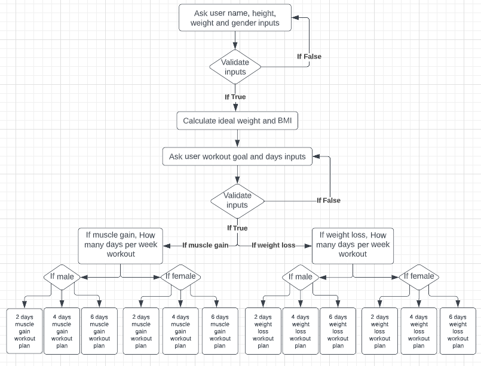
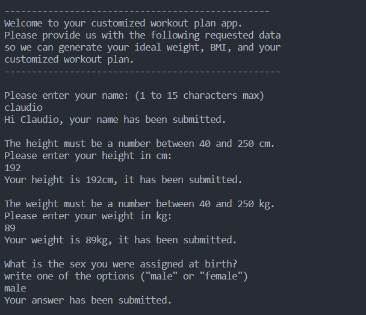
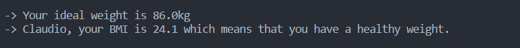
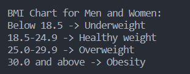
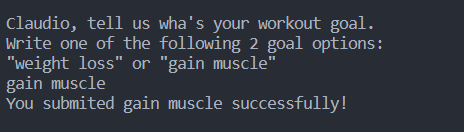
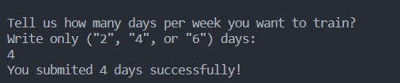
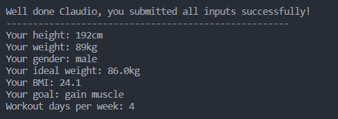
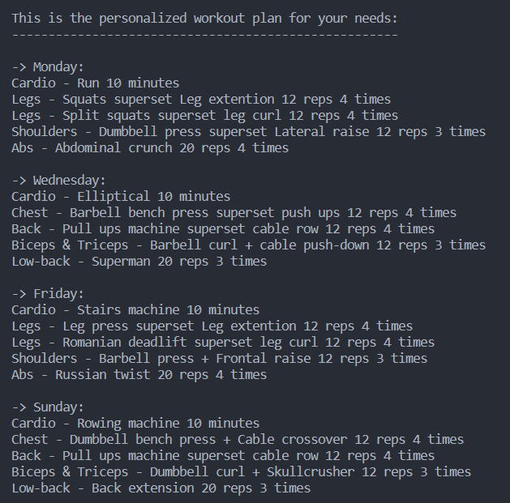

# **Customized Workout Plan**

Customized Workout Plan is a Python terminal app that runs on Heroku.

The Customized Workout Plan app has three main goals: getting the BMI (body mass index), ideal weight, and most importantly, getting a customized workout plan for the user's needs.

The users answer 6 questions. The app runs the code and generates the user's BMI, the user's ideal weight, and the customized workout plan.

#link
#layout image

## How the app works

The user answers the first four questions: “user name”, “user height”, “user weight”, and “user gender”.
The app runs the code using the user's first four answers and prints the BMI and ideal weight.
Then users answer the final two questions: user workout goal ("weight loss" or "gain muscle"), and their user workout days per week (2, 4 or 6 days).
Using all the six user inputs, the code runs a sequence of if/elif and prints the personalized workout plan for the user's specific needs.
See below the scheme of the app.

## Features

- __First four inputs__

  - Name, used to identify the user.
  - Height, used to calculate the ideal weight and BMI.
  - Weight, used to calculate the ideal weight and BMI.
  - Gender, used to calculate the BMI and the workout plan.

- __Ideal weight and BMI__

  - Calculate the user's ideal weight using the formula:
    - 50 + (0.91 * (height - 152.4) for male.
    - 45.5 + (0.91 * (height - 152.4) for female.
  - Calculate the user's BMI using the formula:
    - weight / (height / 100)**2 for male and female.

- __BMI chard__

  - Prints the BMI chart for male and female.

- __Workout goal input__
  - Provide two workout goal options:
    - "weight loss" for lose weight.
    - "gain muscle" for muscle gain.

- __Workout days per week input__

  - Provide three workout options to users:
    - "2" for 2 workout days per week.
    - "4" for 4 workout days per week.
    - "6" for 6 workout days per week.

- __Input submission message__

  - If all inputs are correct, print the following:
    - Print all the user inputs.
    - Print user ideal weight.
    - Print user BMI.

- __Personalized workout plan__

  - Print to the console the personalized workout plan for each user.

## Future features

  - Create more workout goal options: "build strenght" and "crossfit".
  - Automate de workout goal option decision taking into consideration the BMI.
  - Create a diet plan for the customer's needs.

## Data Model

I use six inputs from the user and store the inputs data in variables.
With that input data, the code calculates the ideal weight using two inputs, the user height and user gender.
It also calculates the BMI using the "user height" and "user weight".
Using a sequence of if/elif,the code runs and print the personalized workout plan.

## Testing

I have manually tested this project by doing the following:
  - Passed the code through a PEP8 linter and confirmed there were no problems.
  - When invalid inputs are given, the app prints  message and repeats the input question.
  - Tested all different input types to catch errors in the code, but no errors were found.
  - Tested in my local terminal and in the Heroko terminal. 

## Bugs

- __Solved Bugs__

  - When I tried to call the variables outside the functions, the code gave an error saying "variable not defined". I fixed that bug making the variables golbal.
  - When I wrote the get_user_data function to get the first four inputs, every time one of the inputs was an invalid input, the console went back to the first input question instead of repeating the question that was invalid. I fixed this by creating a while loop for every single input question.
  - When I first created the validate_height_weight function, the code breake every time the weight and right inputs were a leter instead of a number. I fixed that bug using the Try and Except method, converting the input to a float number inside the Try.

## Remaining Bugs

  - There are no remaining bugs.

## Validator Testing

  - PEP8
    - In run.py no errors were returned from the PEP8online.com
    - In workout_plans.py no errors were returned from the PEP8online.com
  
## Deployment

## Credits

- Code Institute for the Gitpod workspace set up.
- www.javatpoint.com for the BMI calculator formula.
- www.bmi-calculator.net for the ideal weight calculator formula.